# General Agenda

**Part 1**: Introduction to Gen-AI

- Welcome, introduction and Overview
- What are Gen-AI Tools or LLMs?
- How they can be used for publishing sector?
- Importance of LLM Settings

---

**Part 2**: Techniques in Prompt Engineering

- Basics and elements of Prompting.
- General Tips for Designing Prompts
- Strategies for Effective Prompting
- Exercises over different roles and tasks

---

**Part 3**: Exploring beyond Prompting

- How to create custom GPTs, importance of system prompt
- Google's tools like NotebookLM and some use cases
- Data Analytics (DA) as one of the ChatGPT Plugins, and possible others
- Other useful plugins or Gen-AI empowered tools 

**Closing**

- Feedback Request and Closing Remarks

# A Little about me

Lecturer in Statistics (FHEA) at the School of Mathematics (SoM), at the University of Edinburgh (UoE). Beyond being a member teaching team in the SoM

* was TEMSE seminars co-organiser and AI lead in the SoM
* Being a part of EdinbR and RSS Edinburgh local groups, GAIL fellow in UoE
* Contributing for Pair Programming club & CDCS 
* Having hats of RoSE network SIG lead (AI for Stats Education), one of the nominated teaching and learning scholar in SICSA across Scotland
* Started to contribute to the international project about Knowledge graphs in LLMs recently (KGELL - Action CA24121)
  
# Which tool can we use? 

- OpenAI: **GPT-5.2** or other legacy models like 5.1 for Instant or Thinking, [ChatGPT](https://chatgpt.com/)

- Google: **Gemini** as Gemini 3 recently. For [Gemini](https://gemini.google.com/app) 

- Antrophic: **Claude-Sonnet 4.5** with its [Claude](https://claude.ai/new)

- Play with various open sources with **HuggingFace platforms**, [HuggingFace playground](https://huggingface.co/playground)

- *University ELM platform*: Edinburgh (access to) Language Models, via [ELM](https://elm.edina.ac.uk/elm/elm)

# Where we are ? 

Please write a specific prompt about from your daily task ?

```
Your prompt
```

Submit your prompt here to see what we need together

- Use the address for submitting: Go to wooclap.com and use the code **SFSKGD**
- Or QR code below

{fig-align="center" width=15%}

---

# The Anatomy of a Good Prompt

A well-crafted prompt typically includes,

- **Role:** Define who the AI should act as

- **Task:** Clearly state what you want

- **Context:** Provide relevant background information

- **Constraints:** Set boundaries (length, tone, format)

- **Examples:** Show what you want if you need (for few-shot prompts)

---

# To check collected materials 

You can see all templates and resources from 
[Github repo for Prompts-Publishing-Training](https://github.com/oevkaya/Prompts-Publishing-Training.git)

OR 

{fig-align="center" width=25%}
---

# Some literacy on LLMs

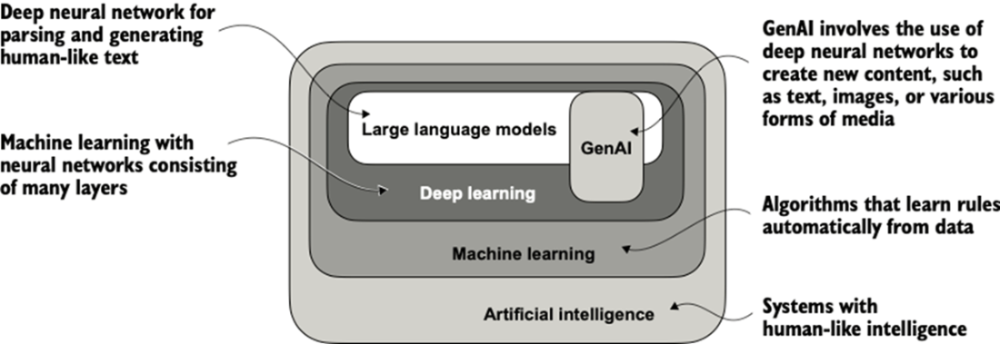{fig-align="center" width=65%}

# Huge Public Interest

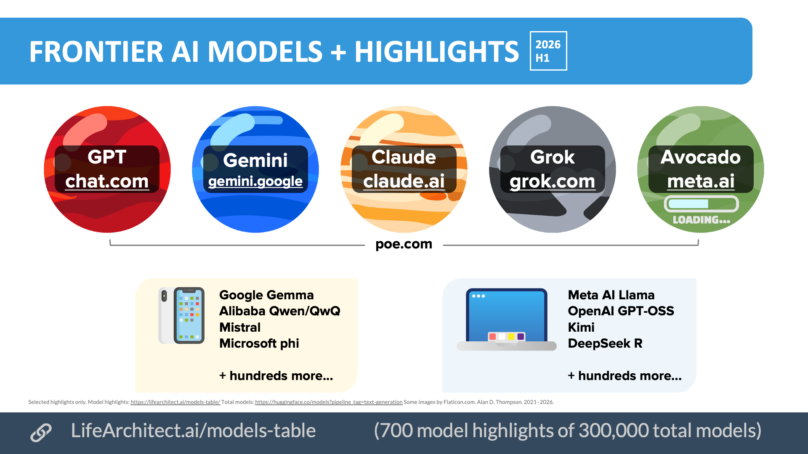{fig-align="center" width=45%}

# Power behind it ?

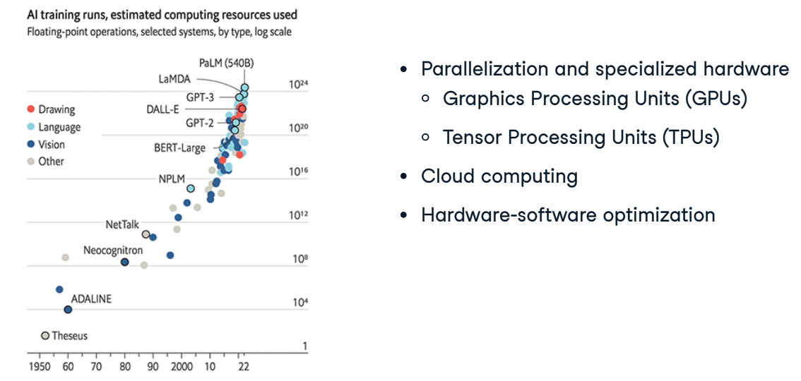{fig-align="center" width=75%}

# Main advancement since 2017 ?

::: {layout-ncol=2}
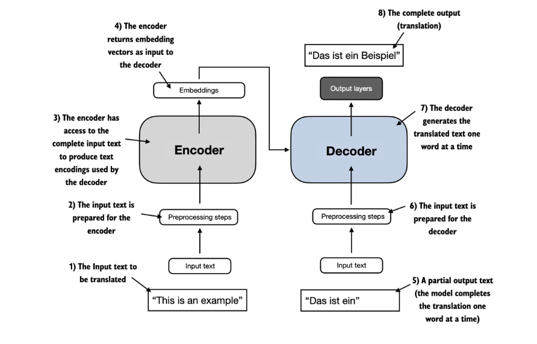{fig-align="center" width=50%}

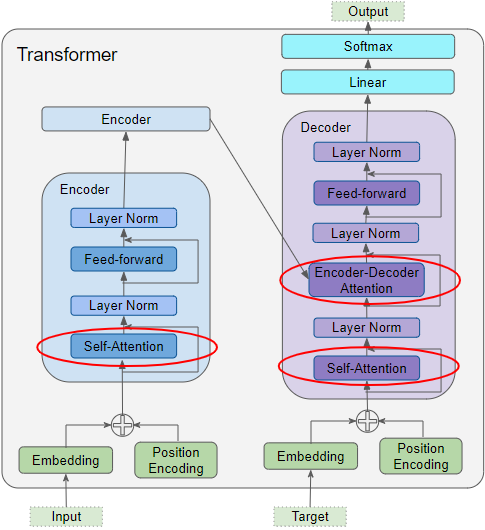{fig-align="center" width=35%}
:::

## Advantages and Limitations of Transformers

- <span style="color: green;"> Parallelization and Efficiency </span>
- <span style="color: green;"> Long-Range Dependencies </span>
- <span style="color: green;"> Transfer Learning and Contextual Embeddings </span>

* <span style="color: red;"> *Attention Overhead for Long Sequences* </span>
* <span style="color: red;"> *Lack of Sequential Order*</span>
* <span style="color: red;"> *Excessive Parameterization*</span>
* <span style="color: red;"> *Fixed Input Length and Inability to Handle Unstructured Inputs*</span>

# Importance of Attention

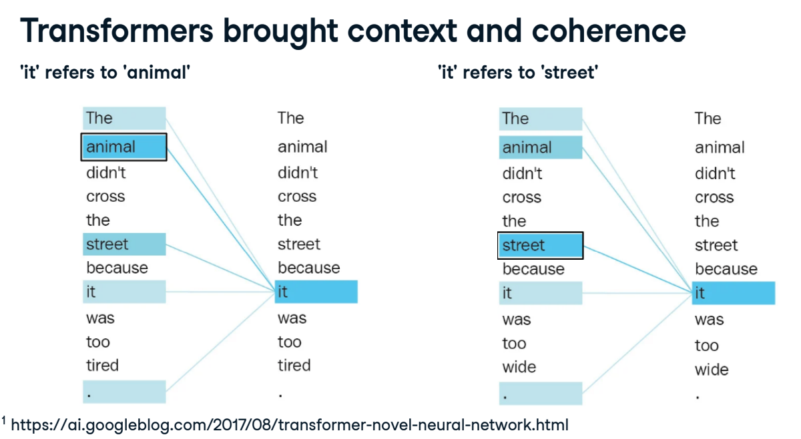{fig-align="center" width=65%}

# LLM tools landscape

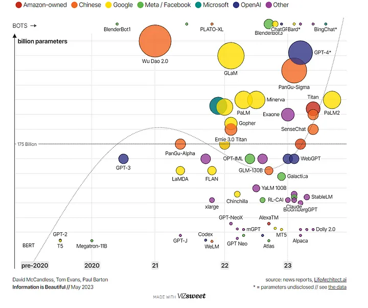{fig-align="center" width=55%}

# What about ChatGPT ?

Only decoder type LLM indeed, but the output improvement relies on the concept of RLHF (Reinforcement Learning with Human Feedback)

- Strengths
  - Understanding of Context, Large-Scale Language Model, Fine-Tuning Process

- Limitations
  - Biases, Inappropriate or Unsafe Outputs, Inability to Fact-Check


# ChatGPT structure

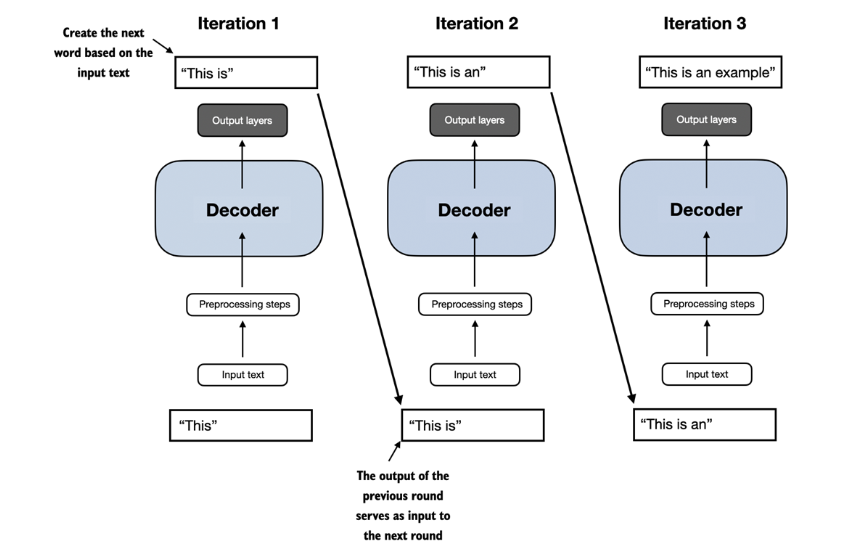{fig-align="center" width=50%}

# Some LLM news 

- Specific: ChatGPT can see, hear and speak (''ChatGPT can now see, hear, and speak.

- [Custom GPTs](https://openai.com/blog/introducing-gpts) are released already! More recently, they released [GPT store](https://openai.com/blog/introducing-the-gpt-store)

- Different versions of GPT models (including 5.2, previously like 4o, mini, o1-preview for advanced reasoning), lastly with some specific settings

- Increase on the multi-agent frameworks for different applications!

- They are like everywhere while even searching in Google 

**What about available tools that we can play with ?**

# Which tool we can use? 

- OpenAI: **GPT-5.2** or other legacy models like 5.1 for Instant or Thinking, [ChatGPT](https://chatgpt.com/)

- Google: **Gemini** as Gemini 3 recently. For [Gemini](https://gemini.google.com/app) 

- Antrophic: **Claude-Sonnet 4.5** with its [Claude](https://claude.ai/new)

- Mistral: Check out their [platform as open-source alternative](https://mistral.ai/product/) or Llama from Meta as open sources

- Play with various open sources with HuggingFace platforms, [HuggingFace playground](https://huggingface.co/playground)

- *University ELM platform*: Edinburgh (access to) Language Models, via [ELM](https://elm.edina.ac.uk/elm/elm)

# Being Gen-AI literate

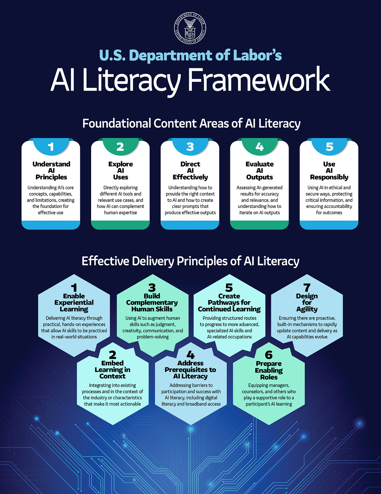{fig-align="center" width=75%}


# Prompt Engineering ?

- This is mainly about writing efficient prompts to use language models (LMs) and possible to consider it as an iterative process. 

- It allows us to better understand the capabilities and limitations of large language models (LLMs)

- Researchers generally use prompt engineering to improve the capacity of the considered LLMs on a wide range of tasks

- It might be crucial to select specific models for certain tasks, do further iterations based on your needs

---

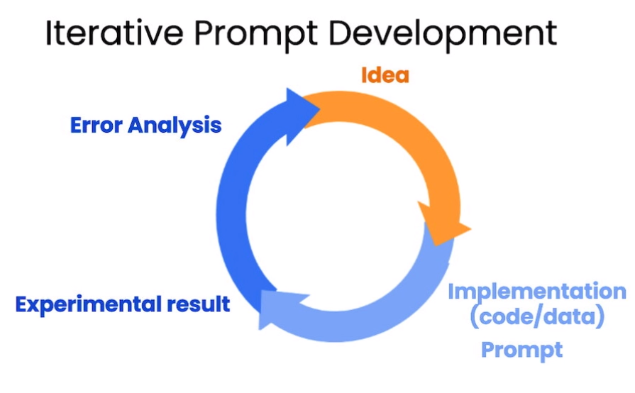{fig-align="center" width=50%}

# About LLM settings 

* When designing and writing prompts, we typically interact with the LLM via an API or more friendly interfaceas such as ChatGPT etc.

* It is crucial to know configured model parameters and how they work in general!
  
**What about these main parameters ?**

# LLM Model Parameters

- *Temperature*
  - **Low:** Produces deterministic, factual outputs. Ideal for fact-based Q&A type tasks .
  - **High:** Encourages creative, diverse responses. Useful for creative tasks like creating poetry or story.

- *Top P (Nucleus Sampling)*
  - **Low:** Yields exact, confident answers. Best for factual responses.
  - **High:** Offers diverse outputs, considering less likely words.

---

- *Max Length*
  - Controls output token count. Helps avoid overly long or irrelevant responses, managing cost.

- *Stop Sequences*
  - Strings that terminate token generation. Used to limit response length and structure.

- *Frequency Penalty*: Penalizes repeated tokens based on frequency. Reduces word repetition in responses.

- *Presence Penalty*: Penalizes all repeated tokens equally. Prevents phrase repetition. Adjust for creativity or focus.
  
---


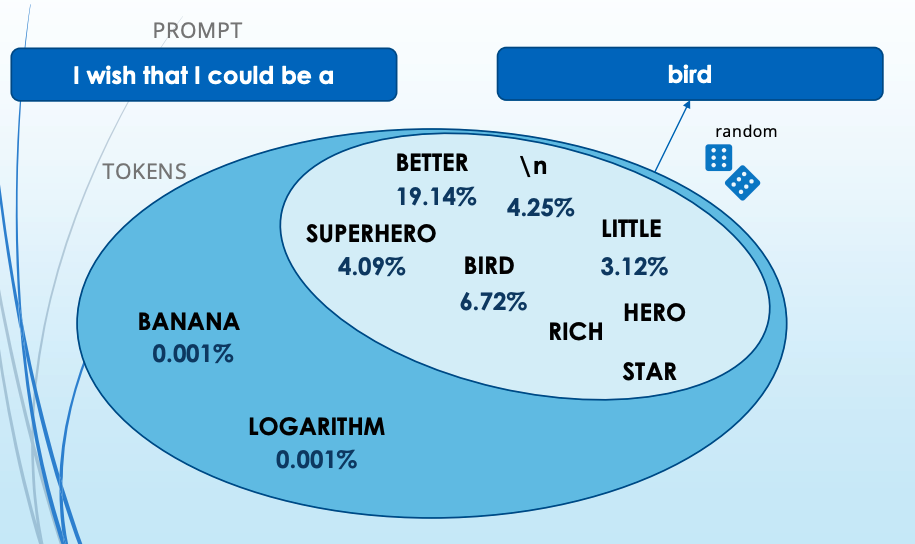{fig-align="center" width=50%}

---

::: {.callout-note}
The general recommendation is to alter **temperature** or **Top P** but **not both**.
:::
  
::: {.callout-note}
Similar to temperature and Top P, the general recommendation is to alter the **frequency** or **presence** penalty but **not both**
:::

::: {.callout-warning}
Keep in mind that your results may vary depending on the which LLM or which version of LLM you use.
:::

Some [further details](https://www.promptingguide.ai/introduction/settings)

# Basic Template 

- **Prompt**: What we want from LLM

- **Output**: What we will get from the LLM 

::: {.callout-note}
A prompt can contain information like the instruction or question you are passing to the model and include other details such as context, inputs, or examples
:::

::: {.callout-tip}
It is possible to use such elements when they are necessary to guide the LLM more effectively, for the purpose of output improvement!
:::

# Elements of a Prompt

- **Instruction**: a specific task or instruction you want the model to perform

- **Context**: external information or additional context that can steer the model to better responses

- **Input Data**: the input or question that we are interested

- **Output Indicator** the type or format of the output.

::: {.callout-warning}
No need all the four elements for a prompt and the format depends on the task.
:::

# Some Examples 

- [Text Summarization](https://www.promptingguide.ai/introduction/examples#text-summarization)

- [Information Extraction](https://www.promptingguide.ai/introduction/examples#information-extraction)

- [Question Answering](https://www.promptingguide.ai/introduction/examples#question-answering)

- [Text Classification or Sentiment Analysis](https://www.promptingguide.ai/introduction/examples#text-classification)

- [Code Generation](https://www.promptingguide.ai/introduction/examples#code-generation)

---

# Your turn for another example

```
Your prompt here
```

# ELM Use-cases

[Examples](https://www.ed.ac.uk/information-services/computing/comms-and-collab/elm/getting-access-and-examples/examples-of-how-to-use-elm-with-prompts)

- Code Writing
- Writing a Literature Review
- Summarising a material
- Searching for academic information
- Learning a subject
- Developing Teaching Plans
- Creating Assessments
- Generating Research Ideas
- Checking response to tutorial questions 
- Create Templates

---

# Re-usable prompts

- Prompt template library to start with
  - Book Concept Development
  - Marketing Copy
  - Metadata Generation
  - Editorial Tasks
  - Data Analysis
  - Quality Control

# An example
  
```
You are a creative publishing strategist with expertise in [CATEGORY]. 
Generate [NUMBER] innovative book concepts for [GENRE/TOPIC] that would 
appeal to [TARGET AUDIENCE]. 

For each concept, provide:
1. A working title briefly in 1-2 sentences
2. One-sentence hook
3. Target audience with details about possible marketing strategies
```

# OpenAI suggestions

- **Write clear instructions**

- **Provide reference text, if we need**

- **Split complex tasks into simpler sub-tasks**

- **Give the model time to "think" or guide them for extra inner verification**

- **Use external tools or knowledge, if we need**

::: {.callout-note}
For each strategy we can see various given tactics below 
:::

# Write clear instructions

- [Include details in your query to get more relevant answers](https://platform.openai.com/docs/guides/prompt-engineering/tactic-include-details-in-your-query-to-get-more-relevant-answers)
 * This is like feeding LLM with important details or context

- [Ask the model to adopt a persona](https://platform.openai.com/docs/guides/prompt-engineering/tactic-ask-the-model-to-adopt-a-persona)
  * You act as a workshop tutor!

- [Use delimiters to clearly indicate distinct parts of the input](https://platform.openai.com/docs/guides/prompt-engineering/tactic-use-delimiters-to-clearly-indicate-distinct-parts-of-the-input)
  * specify the related content explicitly, ie. <article> insert first article here </article>

- [Specify the steps required to complete a task](https://platform.openai.com/docs/guides/prompt-engineering/tactic-specify-the-steps-required-to-complete-a-task)
  * Spliting the task into smaller parts  

- [Provide examples](https://platform.openai.com/docs/guides/prompt-engineering/tactic-provide-examples)

- [Specify the desired length of the output](https://platform.openai.com/docs/guides/prompt-engineering/tactic-specify-the-desired-length-of-the-output)

# Provide reference text

- [Instruct the model to answer using a reference text](https://platform.openai.com/docs/guides/prompt-engineering/tactic-instruct-the-model-to-answer-using-a-reference-text)
  * Adding extra information

- [Instruct the model to answer with citations from a reference text](https://platform.openai.com/docs/guides/prompt-engineering/tactic-instruct-the-model-to-answer-with-citations-from-a-reference-text)
  * Adding external source

# Split complex tasks into simpler subtasks

- [Use intent classification to identify the most relevant instructions for a user query](https://platform.openai.com/docs/guides/prompt-engineering/tactic-use-intent-classification-to-identify-the-most-relevant-instructions-for-a-user-query)

- [For dialogue applications that require very long conversations, summarize or filter previous dialogue](https://platform.openai.com/docs/guides/prompt-engineering/tactic-for-dialogue-applications-that-require-very-long-conversations-summarize-or-filter-previous-dialogue)

- [Summarize long documents piecewise and construct a full summary recursively](https://platform.openai.com/docs/guides/prompt-engineering/tactic-summarize-long-documents-piecewise-and-construct-a-full-summary-recursively)

# Use external tools

- [Use embeddings-based search to implement efficient knowledge retrieval](https://platform.openai.com/docs/guides/prompt-engineering/tactic-use-embeddings-based-search-to-implement-efficient-knowledge-retrieval) More technical, such as RAG method

- [Use code execution to perform more accurate calculations or call external APIs](https://platform.openai.com/docs/guides/prompt-engineering/tactic-use-code-execution-to-perform-more-accurate-calculations-or-call-external-apis)
 * Such as guiding LLM to do something with another tool!

- [Give the model access to specific functions](https://platform.openai.com/docs/guides/prompt-engineering/tactic-give-the-model-access-to-specific-functions)

::: {.callout-note}
Remember that LLM outputs may include hallucination in general, they might be biased and it is necessary to check factual information when it is required! 
:::

# Advanced Methods 

These are some techniques from the open book of [Prompt Engineering Guide](https://www.promptingguide.ai/). Including but not limited to,

- Zero-Shot Prompting

- **Few-Shot Prompting**

- **Chain-of-Thought Prompting**

- Generated Knowledge Prompting

- **[Retrieval Augmented Generation (RAG)](https://arxiv.org/abs/2312.10997)** - nowadays even possible at a certain level with no-coding style

# Few-shot learning 

- Generally, LLms are capable of performing some tasks "zero-shot." Just asking what we want simply

- When zero-shot doesn't work, it's recommended to provide demonstrations or examples in the prompt which leads to few-shot prompting

- This technique enables in-context learning where we provide demonstrations in the prompt to improve the model performance.

- For more difficult tasks, we can experiment with increasing the demonstrations (e.g., **3-shot**, 5-shot, 10-shot, etc.)

::: {.callout-warning}
It is better than zero-shot to some extent but may fail especially when dealing with more complex reasoning tasks!
:::

# Chain of Thought (CoT)

- This method has been popularized to address more complex arithmetic, commonsense, and symbolic reasoning tasks.

- Chain-of-thought (CoT) prompting enables complex reasoning capabilities through intermediate reasoning steps ([Wei et al. (2022)](https://arxiv.org/abs/2201.11903))

- It is possible to combine it with few-shot prompting to get better results on more complex tasks

- You can see different types such as Zero- or Few-shot COT Prompting or Automatic Chain-of-Thought (Auto-CoT)

# CoT Example

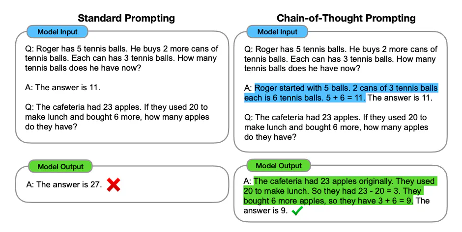{fig-align="center" width=60%}

# More technical: RAGs

- For more complex and knowledge-intensive tasks, it's possible to build a language model-based system that accesses external knowledge sources

- This is a common and one of the cheapest option to reduce the problem of "hallucination" in general

- RAG combines an information retrieval component with a text generator model.

- RAG allows language models to bypass retraining, enabling access to the latest information for generating reliable outputs via retrieval-based generation

# Workflow of RAG

{fig-align="center" width=75%}

Image Credit: [Langchain documentation](https://python.langchain.com/docs/use_cases/question_answering/)

---

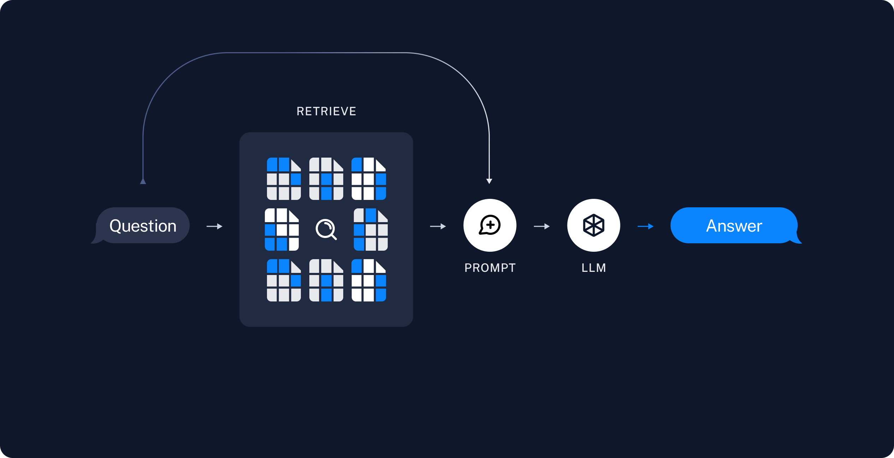{fig-align="center" width=75%}

Image Credit: [Langchain documentation](https://python.langchain.com/docs/use_cases/question_answering/)

---

# Do specific exercises

- Exercise 1: Writing Your First Effective Prompts

- Exercise 2: Book Concept Development with LLMs

- Exercise 3: Creating Compelling Marketing Copy with LLMs

- Exercise 4: Metadata Generation and SEO Optimization with LLMs

---

# System prompt example in custom GPT

::: {.callout-note}
Example with Spring-2023-Catalogue-Web.pdf file for custom GPTs
:::

"Explore your created prompts for the design of suitable system prompt based on your role or tasks to do"

---

# About GPTs via OpenAI interface

::: {.callout-note}
Brief Introduction to ChatGPT Advanced Data Analytics and about GPTs!
:::

"Discover and create custom versions of ChatGPT that combine instructions, extra knowledge, and any combination of skills."

---

# Google's Gemini based NotebookLM

::: {.callout-note}
Your research and thinking partner, grounded in the information that you trust, built with the latest Gemini models.
:::

- "Upload PDFs, websites, YouTube videos, audio files, Google Docs, Google Slides and more, and NotebookLM will summarise them and make interesting connections between topics"

---

- "With all of your sources in place, NotebookLM will get to work and become a personalised AI expert in the information that matters most to you."

- "See the source, not just the answer"

- "Our new Audio Overview feature can turn your sources into engaging 'deep dive' discussions with one click."

> As an organisation or school, your data will stay private to you. As an individual, your data is not used for training unless you share feedback.

---

# Open source or local LLMs

- It is possible to benefit from open source models without any paid subscription (with limited usage) via [HuggingFace](https://huggingface.co/playground)

- Or some specific local usage can be done by certain platforms

::: {.callout-note}
For the safety reasons, it might be better to use Small Language Models (SLM) via certain RAG techniques for in-house solutions
:::

---

# Other selected resources on Prompting 

- A prompt engineering guide that demonstrates many examples in the [hub page](https://www.promptingguide.ai/prompts) can be good to explore  

- [OpenAI Cookbook](https://cookbook.openai.com/)

- [Prompting libraries & tools](https://cookbook.openai.com/articles/related_resources)

- [Google Prompt Engineering page](https://developers.google.com/machine-learning/resources/prompt-eng)

- [Brex's Prompt Engineering Guide](https://github.com/brexhq/prompt-engineering)  Brex's introduction to language models and prompt engineering.

---

# Other LLM empowered tools  

- [SciSpace](https://scispace.com/) - Handle everyday research tasks with reliable, citation-backed results

- [Google Scholar LAb](https://scholar.google.com/scholar_labs/search) - Google Gemini based search for finding research papers

- [Scholar ai](https://scholarai.io/) - Your AI-Powered Research Assistant, recently joined to Jenni (another similar tool) 

---

- [Elicit](https://elicit.com/) - Analyze research papers

- [Perplexity AI](https://www.perplexity.ai/) - Conversational search engine

- ...

Please see other readings on this in the 
[resources file available in the github repository](https://github.com/oevkaya/Prompts-Publishing-Training/blob/main/Resources/Resources.md)

---

# Time to Reflect

Please share your feedback to improve this training

- Go to wooclap.com and use the event code **ZZLRLN**

OR use the QR code for the participant surve below 

{fig-align="center" width=25%}


